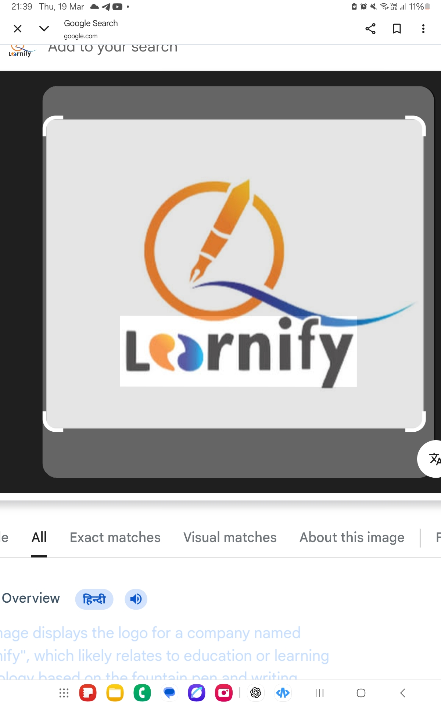

Ahh samajh gaya bhai 😎 — jab code ACode jaise mobile editor me paste karte ho, kabhi formatting ya size ki wajah se issue aata hai. Chalo mai tumhare liye mobile-friendly short version bana deta hoon jo ACode me easily paste ho jaye ✅
🔹 Short & Mobile-Friendly Version (ACode ready)
HTML
Copy code
<!DOCTYPE html>
<html>
<head>
<title>Learnify Webtech</title>

</head>
<body>

<h1>Learnify Webtech</h1>

Ye LCD LED repairing ki training ki website hai

Online or offline dono tareh ki training available hai

<section class="services">
  <h2>Our Services</h2>
  
LCD Repairing

  
LED Repairing

  
Training Courses

</section>

<section class="contact">
  <h2>Contact Us</h2>
  <a href="https://wa.me/919300011498?text=Hello%20mai%20training%20lena%20chahta%20hu">
    <button>WhatsApp</button>
  </a>
</section>

</body>
</html>
✅ Tips for ACODE paste:
Long code ka ek hi block me copy karo
ACode me new file → index.html banake paste karo
Save → phir Run HTML button dabao
Agar logo.jpg nahi dikhe → ya to same folder me image daal do ya koi online image URL use karo
Agar chaho, mai tumhare liye ACode ke liye aur bhi short & clean pro version bana doon jisme footer + multiple buttons bhi ho 😎
Bolo mai bana doon?
